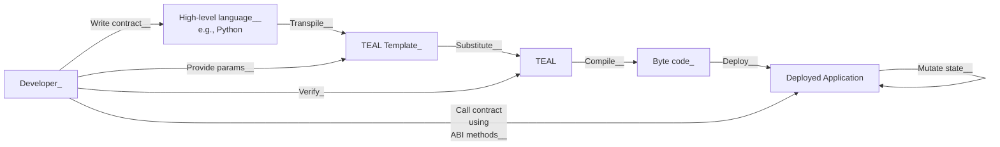
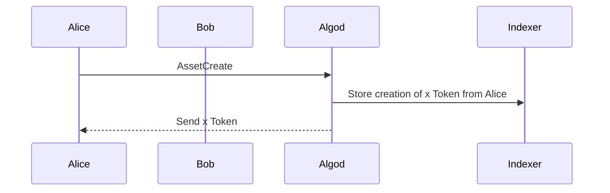
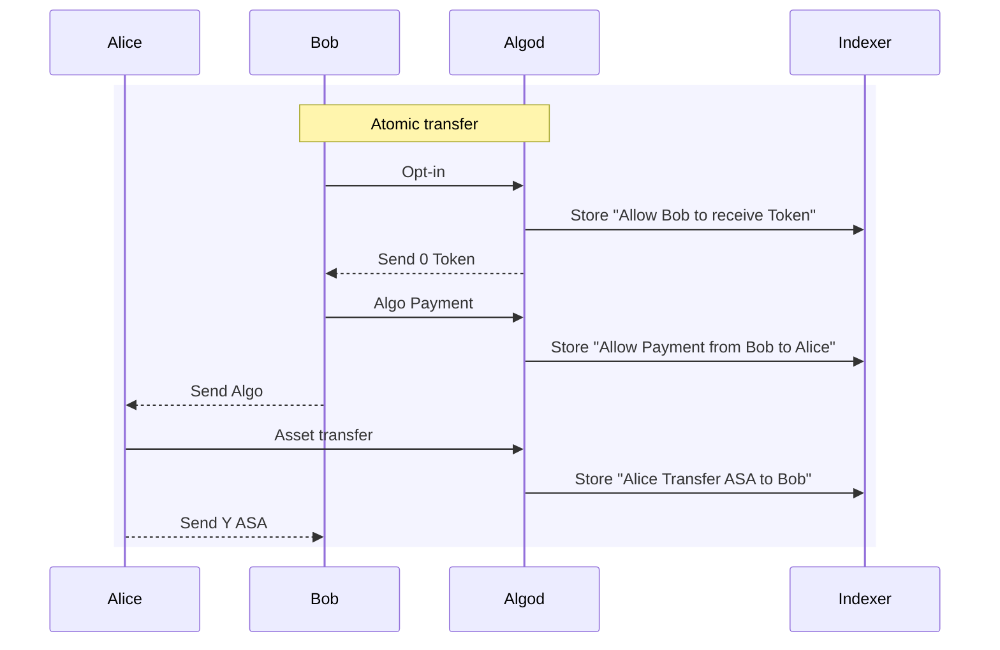
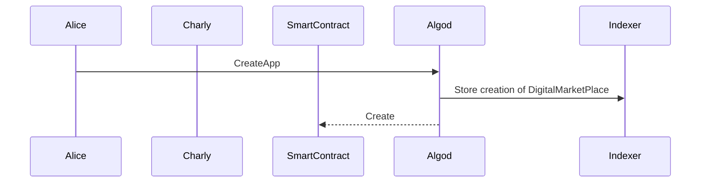
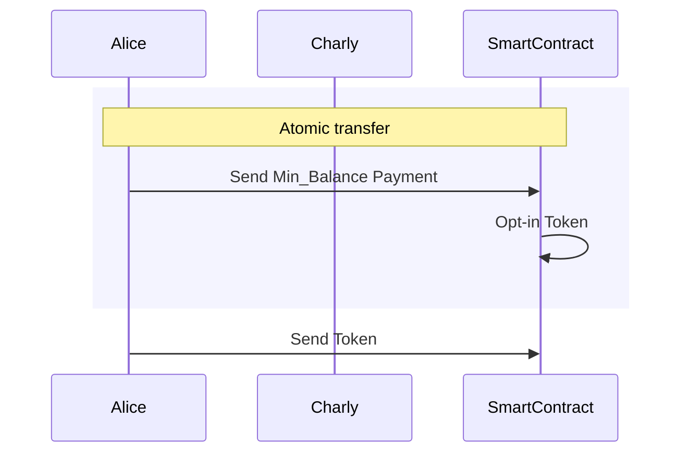
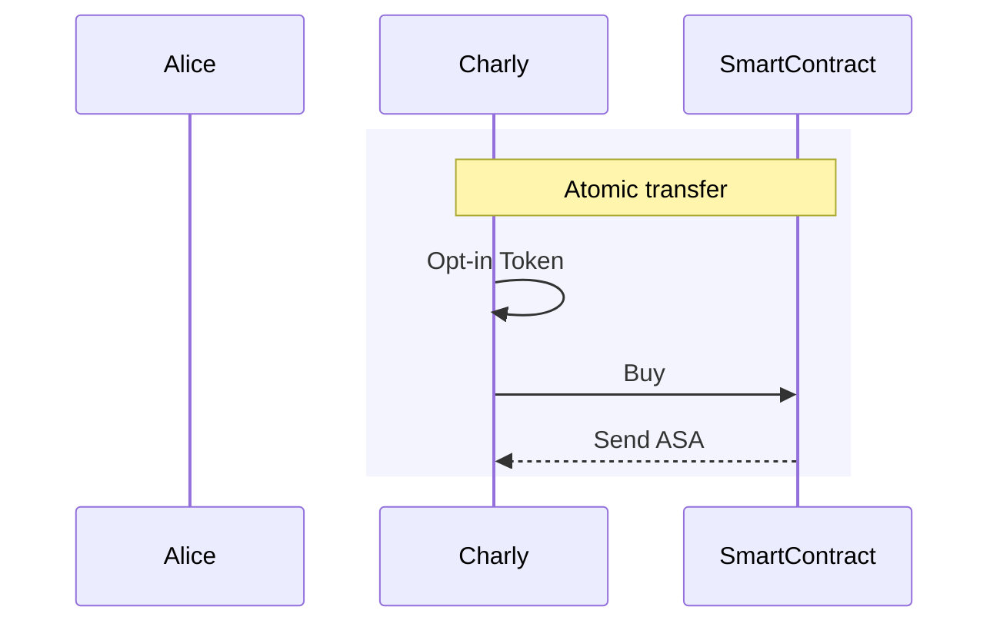
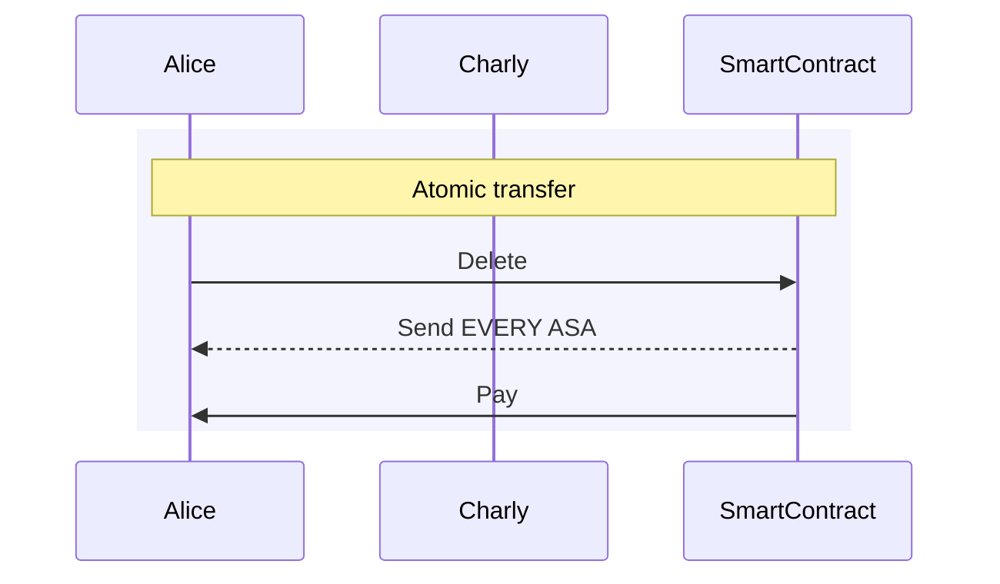

# Introduction

## Abstract

A small project demonstrating the capabilities of blockchain technology.

## Prerequisites

Create a new fork of this project on you Github repository.

## Start the Development Environment

1. Click on the button <button style="background-color: green; color: white; padding: 10px 20px; border: none; border-radius: 4px; cursor: pointer;"><> Code <span data-component="trailingVisual" class="prc-Button-Visual-2epfX prc-Button-VisualWrap-Db-eB"><svg aria-hidden="true" focusable="false" class="octicon octicon-triangle-down" viewBox="0 0 16 16" width="16" height="16" fill="currentColor" style="display: inline-block; user-select: none; vertical-align: text-bottom; overflow: visible;"><path d="m4.427 7.427 3.396 3.396a.25.25 0 0 0 .354 0l3.396-3.396A.25.25 0 0 0 11.396 7H4.604a.25.25 0 0 0-.177.427Z"></path></svg></span></button>
2. Click on the Codespaces Tab
3. Click on <button style="background-color: green; color: white; padding: 10px 20px; border: none; border-radius: 4px; cursor: pointer;">Create codespace on main</button>
4. Wait for everything to be installed properly before going to the next part.

### Verify installation

1. `$ algokit doctor` You should have something similar to the following:

```console
timestamp: 2025-01-07T12:12:41+00:00
AlgoKit: 2.5.1
AlgoKit Python: 3.12.1 (main, Dec 12 2024, 22:30:56) [GCC 9.4.0] (location: /usr/local/py-utils/venvs/algokit)
OS: Linux-6.5.0-1025-azure-x86_64-with-glibc2.31
docker: 27.3.1-1
docker compose: 2.31.0
git: 2.47.1
python: 3.12.1 (location: /home/codespace/.python/current/bin/python)
python3: 3.12.1 (location: /home/codespace/.python/current/bin/python3)
pipx: 1.7.1
poetry: Command not found!
  Poetry is required for some Python-based templates;
  install via `algokit project bootstrap` within project directory, or via:
  https://python-poetry.org/docs/#installation
node: 20.18.1
npm: 10.8.2
```

1. `$ gh codespace ports` Port 4001/4002/5173/8980 should be open:

```console
LABEL  PORT   VISIBILITY  
       4001   public      
       4002   public      
       5173   public      
       5443   private     
       8980   public      
```

## Algokit

### Whats is Algokit

AlgoKit compromises of a number of components that make it the one-stop shop tool for developers building on the Algorand network.



> ABI: [Application Binary Interface](https://arc.algorand.foundation/ARCs/arc-0004)

### Explore the blockchain

Use the command `algokit explore`
It will open a new page with the Algorand Explorer "lora".
Anything you do on your local environment will be displayed here.

> You can also see in real time what's going on the blockchain by switching to MainNet.

# Workshop

**You can use the workshop.py** file already [here]((https://github.com/SudoWeezy/Introduction/blob/workshop/workshop.py)) **OR** do the following:


## Imports

For this workshop you will need to import:

- [Algorand Sdk](https://py-algorand-sdk.readthedocs.io/en/latest/)
- [Algokit Utils](https://algorandfoundation.github.io/algokit-utils-py/html/index.html)

> To make this less cumbersome, you can import methods from the custom utils file.
> We can also import os, to avoid having to type some commands in the terminal.

```python
import os
import algosdk
import algokit_utils
from utils import client_configuration, indexer_configuration, account_creation, display_info
```

## Network Configuration

> We will stay in localnet for this introduction, feel free to modify the `utils.py` file to change network.

We need to setup the [Indexer](https://developer.algorand.org/docs/rest-apis/indexer/) & [Algod](https://developer.algorand.org/docs/rest-apis/algod/?from_query=algod#template-modal-overlay) API that are used to interact with the blockchain.

```python
    algod_client = client_configuration()
    indexer_client = indexer_configuration()
```

You can print these 2 values to check the network configuration is working.

```python
    print(algod_client.block_info(0))
    print(indexer_client.health())
```

## Account Creation

We usually use Alice, Bob and Charly as users to illustrate blockchain documentation.
We will give some Algo to Alice. Bob & Charly will get 1000 by default.

```python
    alice = account_creation(algod_client, "ALICE", funds=100_000_000)
    bob = account_creation(algod_client, "BOB")
    charly = account_creation(algod_client, "CHARLY")
```

## Alice create a new token

### Create an [Asset Configuration Transaction](https://developer.algorand.org/docs/get-details/transactions/transactions/#asset-configuration-transaction)

```python
    create_asa_txn =  algosdk.transaction.AssetCreateTxn(
    sender=alice.address,
    sp=algod_client.suggested_params(),
    total=15,
    decimals=0,
    default_frozen=False,
    unit_name="POA", # 8 Max
    asset_name="Proof of Attendance",
    url="https://github.com/SudoWeezy/introduction",
    note="Hello Github",
    )
    create_asa_signed = create_asa.sign(alice.private_key)
```

> On Algorand you can create a token without a smart-contract by using [Algorand Standard Asset](https://developer.algorand.org/docs/get-details/asa/)



### [Sign the Transaction](https://developer.algorand.org/docs/get-details/transactions/signatures/)

```python
    create_asa_tx_id = algod_client.send_transaction(create_asa_signed)
```

### Send the transaction to the network

```python
    res = algosdk.transaction.wait_for_confirmation(algod_client, create_asa_tx_id, 4)
    asset_id = res["asset-index"]
```

### Bob buy the token from Alice

#### [Atomic transfer](https://developer.algorand.org/docs/get-details/atomic_transfers/)

This simply means that transactions that are part of the transfer either all succeed or all fail. 

[Why it is needed in video](https://www.youtube.com/watch?v=DTFgvZm1bCk)

#### [Atomic Transaction composer](https://developer.algorand.org/docs/get-details/atc/)

We will bind 3 transactions in the atomic transfer:

- Bob allow the asset created by Alice to enter his account -> [Opt-in](https://developer.algorand.org/docs/get-details/transactions/transactions/#asset-optin-transaction)
- Bob send the money to Alice -> [Payment](https://developer.algorand.org/docs/get-details/transactions/transactions/#payment-transaction)
- Alice send the token to Bob -> [Asset Transfer](https://developer.algorand.org/docs/get-details/transactions/transactions/#asset-transfer-transaction)



## [Smart contract](https://developer.algorand.org/docs/get-details/dapps/smart-contracts/apps/)

Now that you have some experience in building transactions. Even if we are using blockchain, we still need a backend to trigger each transaction. This is not really efficient.
Let's deploy a smart contract on the blockchain so that everyone can interact with it directly.

### Define the Digital Market Place

We will define 5 methods:

- `create_application` (Initialize the smart contract with the asset_id and the unitary_price)
- [Optional] `set_price` (In case Alice changes her mind and wants to change the price)
- `opt_in_to_asset` (Like Any account, to hold an asset, the smart contract needs to opt-in)
- `buy` (Allows someone to buy an asset from the smart contract)
- `delete_application` (When Alice don't wants to send her token anymore and get the money back)

**You can use the app.py** file already [here]((https://github.com/SudoWeezy/Introduction/blob/workshop/app.py)) **OR** do the following:

#### Code the smart contract

```python
from algopy import (
    Asset,  # On Algorand, assets are native objects rather than smart contracts
    Global, # Global is used to access global variables from the network
    Txn,    # Txn is used access information about the current transaction
    UInt64, # By default, all numbers in the AVM are 64-bit unsigned integers
    arc4,   # ARC4 defines the Algorand ABI for method calling and type encoding
    gtxn,   # gtxn is used to read transaction within the same atomic group
    itxn,   # itxn is used to send transactions from within a smart contract
)
```

```python
class DigitalMarketplace(arc4.ARC4Contract):
    asset_id: UInt64      # We want to store the ID for the asset we are selling
    unitary_price: UInt64 # We want to store the price for the asset we are selling
    @arc4.abimethod(allow_actions=["NoOp"],create="require")
        # There are certain actions that a contract call can do
        # Some examples are UpdateApplication, DeleteApplication, and NoOp
        # NoOp is a call that does nothing special after it is exected    
        # Require that this method is only callable when creating the app
    def create_application(self, asset_id: Asset, unitary_price: UInt64) -> None:
        self.asset_id = asset_id.id # The ID of the asset we're selling
        self.unitary_price = unitary_price # The initial sale price

    @arc4.abimethod
    def set_price(self, unitary_price: UInt64) -> None:
        assert Txn.sender == Global.creator_address # We don't want anyone to be able to modify the price, only the app creator can
        self.unitary_price = unitary_price

    # Before any account can receive an asset, it must opt-in to it
    # This method enables the application to opt-in to the asset
    @arc4.abimethod
    def opt_in_to_asset(self, mbr_pay: gtxn.PaymentTransaction) -> None: # Need to send a payment to cover data usage
        # We want to make sure that the application address is not already opted in
        assert not Global.current_application_address.is_opted_in(Asset(self.asset_id))
        assert mbr_pay.receiver == Global.current_application_address
        # Every accounts has an MBR of 0.1 ALGO (Global.min_balance)
        # Opting into an asset increases the MBR by 0.1 ALGO (Global.asset_opt_in_min_balance)
        assert mbr_pay.amount == Global.min_balance + Global.asset_opt_in_min_balance
        itxn.AssetTransfer(
            xfer_asset=self.asset_id,
            asset_receiver=Global.current_application_address,
            asset_amount=0,
        ).submit()

    @arc4.abimethod
    def buy(self, buyer_txn: gtxn.PaymentTransaction, quantity: UInt64) -> None:
        # To buy assets, a payment must be sent
        # The quantity of assets to buy

        # We need to verify that the payment is being sent to the application
        # and is enough to cover the cost of the asset
        assert buyer_txn.sender == Txn.sender
        assert buyer_txn.receiver == Global.current_application_address
        assert buyer_txn.amount == self.unitary_price * quantity

        # Once we've verified the payment, we can transfer the asset
        itxn.AssetTransfer(
            xfer_asset=self.asset_id,
            asset_receiver=Txn.sender,
            asset_amount=quantity,
        ).submit()

    @arc4.abimethod(allow_actions=["DeleteApplication"])
    def delete_application(self) -> None: # Only allow the creator to delete the application
        assert Txn.sender == Global.creator_address # Send all the unsold assets to the creator
        itxn.AssetTransfer(
            xfer_asset=self.asset_id,
            asset_receiver=Global.creator_address,
            asset_amount=0,
            # Close the asset to unlock the 0.1 ALGO that was locked in opt_in_to_asset
            asset_close_to=Global.creator_address,
        ).submit()
        itxn.Payment(receiver=Global.creator_address, amount=0, close_remainder_to=Global.creator_address).submit()
        # Get back ALL the ALGO in the creatoraccount
```

#### Compile the smart contract

The following command will compile the smart contract and output the ABI and the TEAL File.

[Teal is the language of the Algorand Virtual Machine](https://developer.algorand.org/docs/get-details/dapps/avm/teal/specification/)

```python
os.system("algokit compile py --out-dir ./app app.py")
```

#### Create the client for the application

Similar to an [API](https://en.wikipedia.org/wiki/API).
Now that we have the ABI and the Teal file, we will generate the client to interact with the application.

```python
os.system("algokit generate client app/DigitalMarketplace.arc32.json --output client.py")
```

### Interact with the smart contract

#### Initialize the client

```python
    from client import DigitalMarketplaceClient,Composer
    app_client = DigitalMarketplaceClient(
        algod_client,
        creator=alice,
        indexer_client=indexer_client
    )
```

#### Alice create the smart contract

[Application call Transaction](https://developer.algorand.org/docs/get-details/transactions/transactions/#application-call-transaction)

```python
    app_client.create_create_application(asset_id=asset_id, unitary_price=price)
    app_id = app_client.app_id
    display_info(algod_client, ["ALICE"])
    print(f"App {app_id} deployed with address {app_client.app_address}")
```



#### Transfer ASA to DigitalMarketplace

```python
    sp = algod_client.suggested_params()
    sp.fee = sp.min_fee # extra_fee
    mbr_pay_txn = algosdk.transaction.PaymentTxn(
        sender=alice.address,
        sp=sp,
        receiver=app_client.app_address,
        amt=200_000, #0,1 account creation + 0,1 Hold ASA
    )

    app_client.opt_in_to_asset(
        mbr_pay=algosdk.atomic_transaction_composer.TransactionWithSigner(mbr_pay_txn, signer=alice.signer),
        transaction_parameters=algokit_utils.TransactionParameters(
            # The asset ID must be declared for the Algorand Virtual Machine (AVM) to use it
            foreign_assets=[asset_id]
        )
    )
    

    print(f"App can now Hold ASA-ID= {algod_client.account_info(app_client.app_address)['assets']}")
    
    print("Alice send ASAs to the App")
    algod_client.send_transaction(algosdk.transaction.AssetTransferTxn(
        sender=alice.address,
        sp=algod_client.suggested_params(),
        amt=10,
        receiver=app_client.app_address,
        index=asset_id
    ).sign(alice.private_key))
    print(f"Hold ASA-ID= {algod_client.account_info(app_client.app_address)['assets']}")
```

> To simplify, from now on, I will replace Algod, Indexer and Smart_Contract by "Smart_Contract".



#### Charly Buy a token from the Smart Contract

```python
    amount_to_buy = 2
    print("Charly buy {amount_to_buy} token")
    sp = algod_client.suggested_params()
    sp.fee = sp.min_fee # extra_fee

    opt_in_asa = algosdk.transaction.AssetOptInTxn(
        sender=charly.address,
        sp=algod_client.suggested_params(),
        index= asset_id
    )
    opt_in_tws = algosdk.atomic_transaction_composer.TransactionWithSigner(opt_in_asa, charly.signer)

    buyer_payment_txn = algosdk.transaction.PaymentTxn(
        sender=charly.address,
        sp=sp,
        receiver=app_client.app_address,
        amt=amount_to_buy * app_client.get_global_state().unitary_price, # Micro Algo
    )

    atc = algosdk.atomic_transaction_composer.AtomicTransactionComposer()
    atc.add_transaction(opt_in_tws)
    
    app_client_composer = Composer(app_client=app_client.app_client, atc=atc)
    buy_txn = app_client_composer.buy(
        buyer_txn=algosdk.atomic_transaction_composer.TransactionWithSigner(
            txn=buyer_payment_txn, signer=charly.signer),
            quantity=2,
            transaction_parameters=algokit_utils.TransactionParameters(
            sender=charly.address,
            signer=charly.signer,
            # Inform the AVM that the transaction uses this asset
            foreign_assets=[asset_id],
        ),
    ).build()

    buy_txn.execute(algod_client, wait_rounds=4)
```



#### Delete Application

Now that some user bought Tokens, Alice wants to delete the Smart-Contract to get Algo and tokens back.

```python
    print("Alice delete the app and get ASA and Algo back")

    sp = algod_client.suggested_params()
    sp.fee = 3*sp.min_fee 

    # Delete the smart contract application
    app_client.delete_delete_application(
        transaction_parameters=algokit_utils.TransactionParameters(
            # Tell the AVM that the transaction involves this asset
            foreign_assets=[asset_id],
            suggested_params=sp,
        )
    )
```



## Debug

- If you have the following error: `algosdk.error.AlgodHTTPError: HTTP Error 502: Bad Gateway`
- Or to reset your local network
Run the `algokit localnet reset command`.

## Resources

- [Full code for Workshop.py](https://github.com/SudoWeezy/Introduction/blob/workshop/workshop.py)
- [Full code for app.py](https://github.com/SudoWeezy/Introduction/blob/workshop/app.py)
- [Install AlgoKit](https://github.com/algorandfoundation/algokit-cli/blob/main/README.md#install)
- [Quick Start Tutorial](https://github.com/algorandfoundation/algokit-cli/blob/main/docs/tutorials/intro.md)
- [Documentation](https://github.com/algorandfoundation/algokit-cli/blob/main/docs/algokit.md)
- [Transactions](https://developer.algorand.org/docs/get-details/transactions/transactions/)
